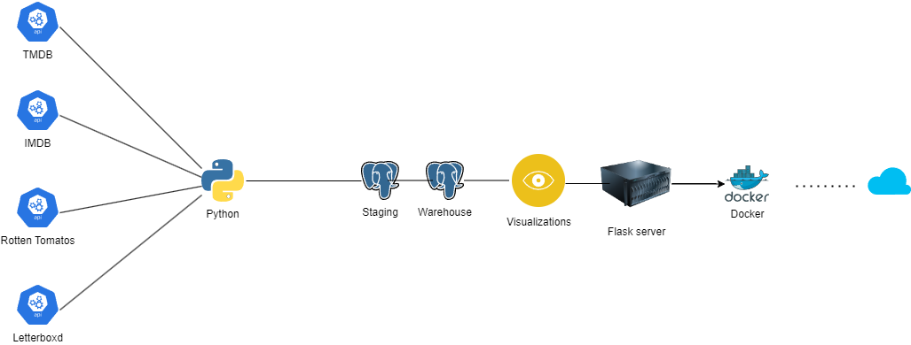

Hello! 

I am an aspiring Data Engineer

This is project that will hopefully turn into a full blown CI/CD DE Pipeline!

The point of this project is to pull in a few movie based APIs into python. Clean and manipulate them as dataframes, save them to postgresQL, open back to python and create visualizations and then host on a flask server.

Here is the basic architecture while I learn what I need to do

